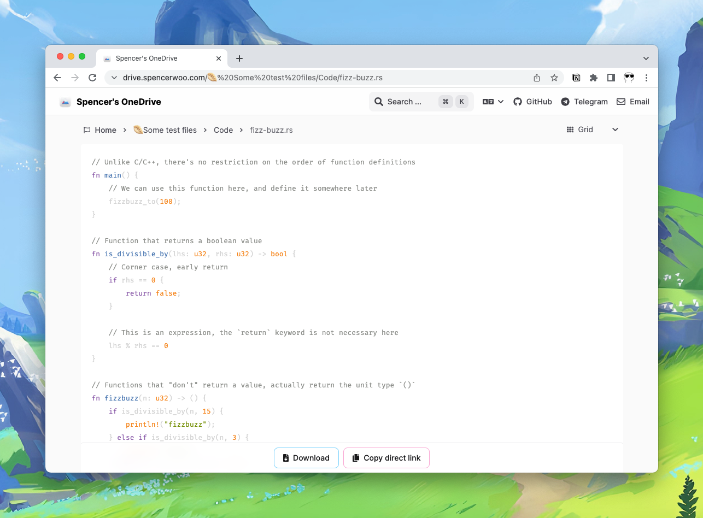
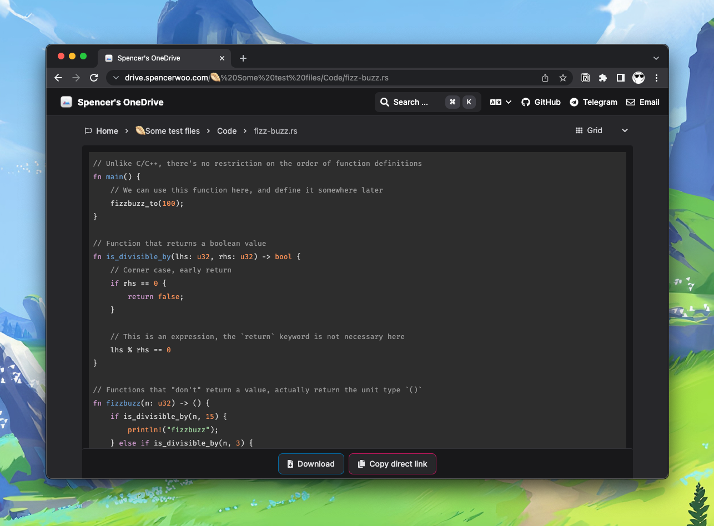
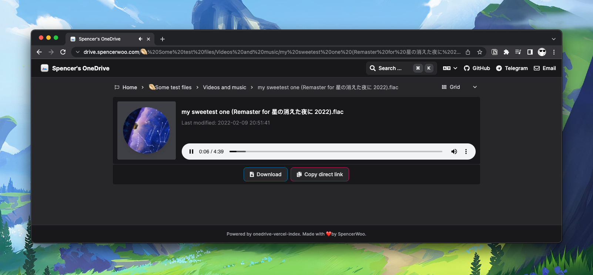
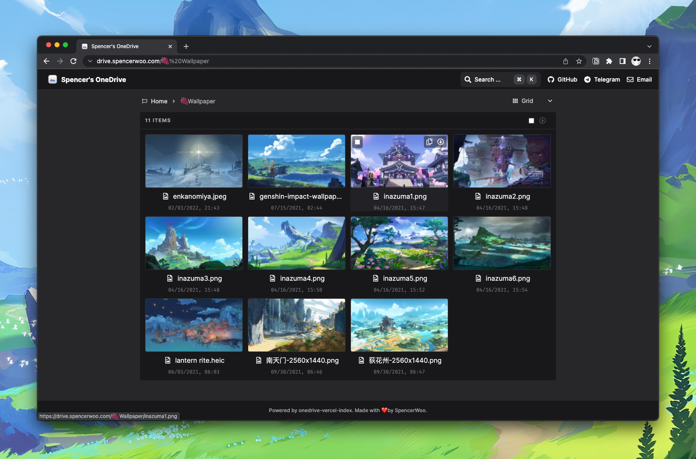
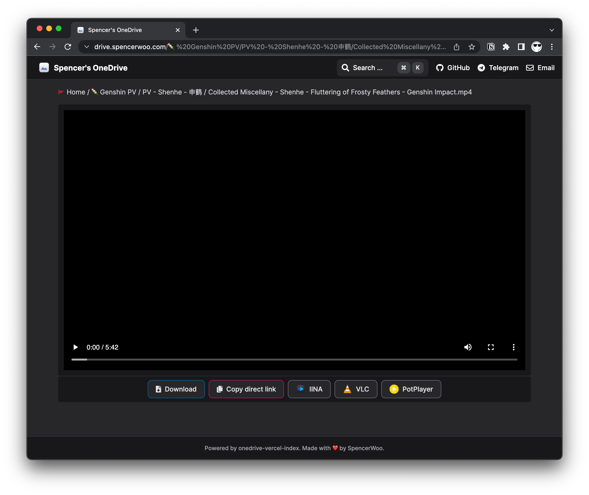
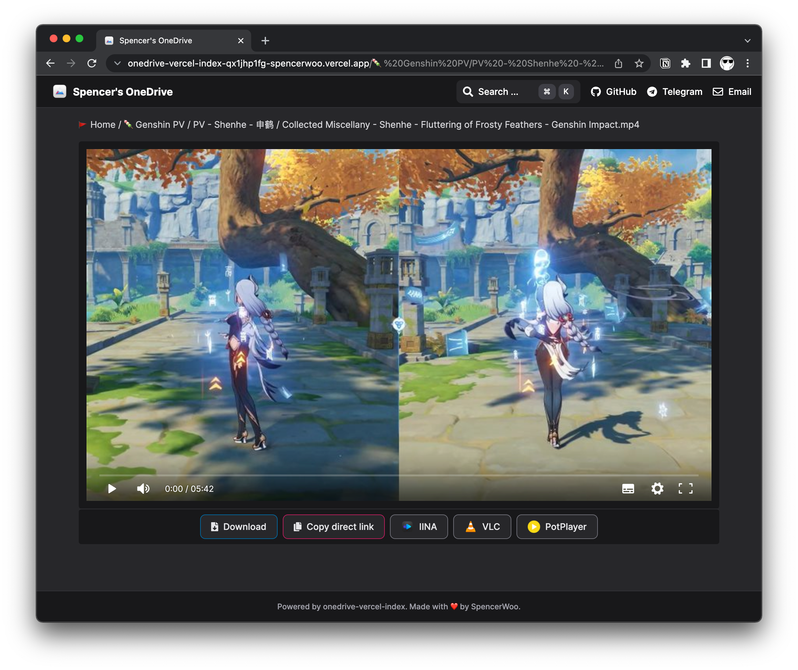
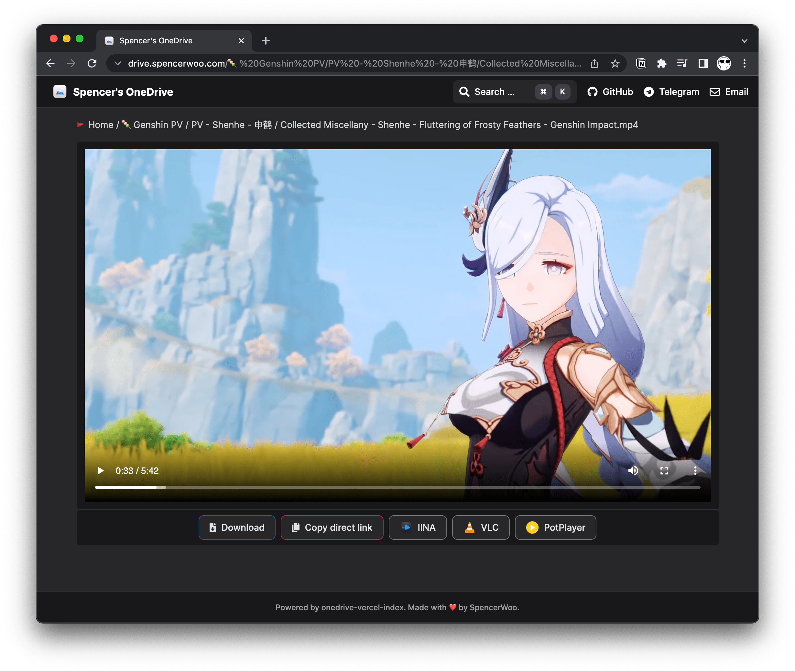
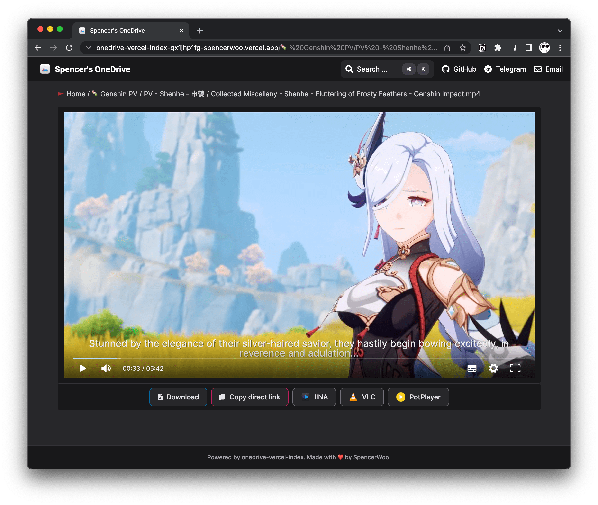
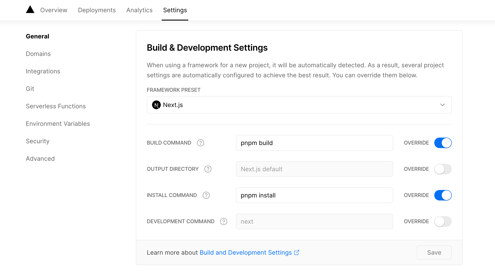

# 更新日志
---
title: Hexo-Butterfly样式修改
---
## 文件头部配置
### Page Front-matter

| 写法 | 解释 |
| --- | --- |
| title | 【必需】页面标题 |
| date | 【必需】页面创建日期 |
| type | 【必需】标籤、分类和友情链接三个页面需要配置 |
| updated | 【可选】页面更新日期 |
| description | 【可选】页面描述 |
| keywords | 【可选】页面关键字 |
| comments | 【可选】显示页面评论模块(默认 true) |
| top_img | 【可选】页面顶部图片 |
| mathjax | 【可选】显示 mathjax(当设置 mathjax 的 per_page: false 时，才需要配置，默认 false) |
| katex | 【可选】显示 katex(当设置 katex 的 per_page: false 时，才需要配置，默认 false) |
| aside | 【可选】显示侧边栏 (默认 true) |
| aplayer | 【可选】在需要的页面加载 aplayer 的 js 和 css,请参考文章下面的`音乐` 配置 |
| highlight_shrink | 【可选】配置代码框是否展开(true/false)(默认为设置中 highlight_shrink 的配置) |

### Post Front-matter

| 写法 | 解释 |
| --- | --- |
| title | 【必需】文章标题 |
| date | 【必需】文章创建日期 |
| updated | 【可选】文章更新日期 |
| tags | 【可选】文章标籤 |
| categories | 【可选】文章分类 |
| keywords | 【可选】文章关键字 |
| description | 【可选】文章描述 |
| top_img | 【可选】文章顶部图片 |
| cover | 【可选】文章缩略图(如果没有设置 top_img,文章页顶部将显示缩略图，可设为 false/图片地址/留空) |
| comments | 【可选】显示文章评论模块(默认 true) |
| toc | 【可选】显示文章 TOC(默认为设置中 toc 的 enable 配置) |
| toc_number | 【可选】显示 toc_number(默认为设置中 toc 的 number 配置) |
| copyright | 【可选】显示文章版权模块(默认为设置中 post_copyright 的 enable 配置) |
| copyright_author | 【可选】文章版权模块的`文章作者` |
| copyright_author_href | 【可选】文章版权模块的`文章作者`链接 |
| copyright_url | 【可选】文章版权模块的`文章连结`链接 |
| copyright_info | 【可选】文章版权模块的`版权声明`文字 |
| mathjax | 【可选】显示 mathjax(当设置 mathjax 的 per_page: false 时，才需要配置，默认 false) |
| katex | 【可选】显示 katex(当设置 katex 的 per_page: false 时，才需要配置，默认 false) |
| aplayer | 【可选】在需要的页面加载 aplayer 的 js 和 css,请参考文章下面的`音乐` 配置 |
| highlight_shrink | 【可选】配置代码框是否展开(true/false)(默认为设置中 highlight_shrink 的配置) |
| aside | 【可选】显示侧边栏 (默认 true) |
| hide | 【可选】隐藏文章 |
| sticky | 【可选】文章置顶，值越大越考上 |

***
## 外挂标签Note

### 内置图标



<!-- tab simple -->
```

默认 提示块标签



default 提示块标签



primary 提示块标签



success 提示块标签



info 提示块标签



warning 提示块标签



danger 提示块标签

```



默认 提示块标签



default 提示块标签



primary 提示块标签



success 提示块标签



info 提示块标签



warning 提示块标签



danger 提示块标签



<!-- endtab -->

<!-- tab modern -->

```

默认 提示块标签



default 提示块标签



primary 提示块标签



success 提示块标签



info 提示块标签



warning 提示块标签



danger 提示块标签

```


默认 提示块标签



default 提示块标签



primary 提示块标签



success 提示块标签



info 提示块标签



warning 提示块标签



danger 提示块标签


<!-- endtab -->

<!-- tab flat -->
```

默认 提示块标签



default 提示块标签



primary 提示块标签



success 提示块标签



info 提示块标签



warning 提示块标签



danger 提示块标签

```


默认 提示块标签



default 提示块标签



primary 提示块标签



success 提示块标签



info 提示块标签



warning 提示块标签



danger 提示块标签


<!-- endtab -->

<!-- tab disabled -->

```

默认 提示块标签



default 提示块标签



primary 提示块标签



success 提示块标签



info 提示块标签



warning 提示块标签



danger 提示块标签

```


默认 提示块标签



default 提示块标签



primary 提示块标签



success 提示块标签



info 提示块标签



warning 提示块标签



danger 提示块标签



<!-- endtab -->

<!-- tab no-icon -->
```

默认 提示块标签



default 提示块标签



primary 提示块标签



success 提示块标签



info 提示块标签



warning 提示块标签



danger 提示块标签

```


默认 提示块标签



default 提示块标签



primary 提示块标签



success 提示块标签



info 提示块标签



warning 提示块标签



danger 提示块标签


<!-- endtab -->




### 自定义图标




<!-- tab simple -->

```

你是刷 Visa 还是是 UnionPay


2021 年快到了....


小心开车 安全至上


这是三片呢？还是四片？


该充电了哦！


剪刀石頭布


前端最討厭的瀏覽器

```

你是刷 Visa 还是是 UnionPay


2021 年快到了....


小心开车 安全至上


这是三片呢？还是四片？


该充电了哦！


剪刀石頭布


前端最討厭的瀏覽器



<!-- endtab -->
<!-- tab modern -->

```

你是刷 Visa 还是是 UnionPay


2021 年快到了....


小心开车 安全至上


这是三片呢？还是四片？


该充电了哦！


剪刀石頭布


前端最討厭的瀏覽器

```

你是刷 Visa 还是是 UnionPay


2021 年快到了....


小心开车 安全至上


这是三片呢？还是四片？


该充电了哦！


剪刀石頭布


前端最討厭的瀏覽器



<!-- endtab -->
<!-- tab flat -->

```

你是刷 Visa 还是是 UnionPay


2021 年快到了....


小心开车 安全至上


这是三片呢？还是四片？


该充电了哦！


剪刀石頭布


前端最討厭的瀏覽器

```


你是刷 Visa 还是是 UnionPay


2021 年快到了....


小心开车 安全至上


这是三片呢？还是四片？


该充电了哦！


剪刀石頭布


前端最討厭的瀏覽器


<!-- endtab -->
<!-- tab disabled -->


```

你是刷 Visa 还是是 UnionPay


2021 年快到了....


小心开车 安全至上


这是三片呢？还是四片？


该充电了哦！


剪刀石頭布


前端最討厭的瀏覽器

```


你是刷 Visa 还是是 UnionPay


2021 年快到了....


小心开车 安全至上


这是三片呢？还是四片？


该充电了哦！


剪刀石頭布


前端最討厭的瀏覽器


<!-- endtab -->
<!-- tab no-icon -->
```

你是刷 Visa 还是 UnionPay


2021 年快到了....


小心开车 安全至上


这是三片呢？还是四片？


你是刷 Visa 还是 UnionPay


剪刀石头布


前端最讨厌的浏览器

```


你是刷 Visa 还是 UnionPay


2021 年快到了....


小心开车 安全至上


这是三片呢？还是四片？


你是刷 Visa 还是 UnionPay


剪刀石头布


前端最讨厌的浏览器


<!-- endtab -->



***
## 行内文本样式



<!-- tab 下划线 -->
```
<u>下划线</u>
```
<u>下划线</u>
<!-- endtab -->

<!-- tab 着重线 -->
```
<emp>着重线</emp>
```
<emp>着重线</emp>
<!-- endtab -->

<!-- tab 波浪线 -->
```
<wavy>波浪线</wavy>
```
<wavy>波浪线</wavy>
<!-- endtab -->

<!-- tab 删除线 -->
```
<del>删除线</del>
```
<del>删除线</del>
<!-- endtab -->

<!-- tab 按键 -->
```
<kbd>command</kbd>
```
<kbd>command</kbd>
<!-- endtab -->

<!-- tab 隐藏框 -->
```
<psw>这里没有验证码</psw>
```
<psw>这里没有验证码</psw>
<!-- endtab -->


***
## 行内文本 span


<!-- tab 标签语法-->
```

```
<!-- endtab -->

<!-- tab 配置参数 -->
1. 字体: logo, code
2. 颜色: red,yellow,green,cyan,blue,gray
3. 大小: small, h4, h3, h2, h1, large, huge, ultra
4. 对齐方向: left, center, right

<!-- endtab -->

<!-- tab 样式预览 -->
- 彩色文字
在一段话中方便插入各种颜色的标签，包括：、、、、、。
- 超大号文字
文档「开始」页面中的标题部分就是超大号文字。



<!-- endtab -->

<!-- tab 示例源码 -->
```
- 彩色文字
在一段话中方便插入各种颜色的标签，包括：、、、、、。
- 超大号文字
文档「开始」页面中的标题部分就是超大号文字。


```
<!-- endtab -->



```HTML
<span class="inline-tag [red|green|blue|yellow|grey]">语法</span>
<span class="inline-tag red">红色小标签</span>
<span class="inline-tag green">绿色小标签</span>
<span class="inline-tag blue">蓝色小标签</span>
<span class="inline-tag yellow">黄色小标签</span>
<span class="inline-tag grey">灰色小标签</span>
```
<span class="inline-tag red">红色小标签</span>&nbsp;<span class="inline-tag green">绿色小标签</span>&nbsp;<span class="inline-tag blue">蓝色小标签</span>&nbsp;<span class="inline-tag yellow">黄色小标签</span>&nbsp;<span class="inline-tag grey">灰色小标签</span>

```
<span class="inline-tag" style="--Color:#9c9">自定义颜色小标签</span>
```
<span class="inline-tag" style="--Color:#9c9">自定义颜色小标签</span>

***
## label标签
```





```
&nbsp;&nbsp;&nbsp;&nbsp;


***


<!-- tab 示例 -->

臣亮言：創業未半，而。今天下三分，，此誠也！然侍衞之臣，不懈於內；，忘身於外者，蓋追先帝之殊遇，欲報之於陛下也。誠宜開張聖聽，以光先帝遺德，恢弘志士之氣；不宜妄自菲薄，引喻失義，以塞忠諫之路也。
宮中、府中，俱為一體；陟罰臧否，不宜異同。若有、，及為忠善者，宜付有司，論其刑賞，以昭陛下平明之治；不宜偏私，使內外異法也。

<!-- endtab -->
<!-- tab 代码 -->
```
臣亮言：創業未半，而。今天下三分，，此誠也！然侍衞之臣，不懈於內；，忘身於外者，蓋追先帝之殊遇，欲報之於陛下也。誠宜開張聖聽，以光先帝遺德，恢弘志士之氣；不宜妄自菲薄，引喻失義，以塞忠諫之路也。
宮中、府中，俱為一體；陟罰臧否，不宜異同。若有、，及為忠善者，宜付有司，論其刑賞，以昭陛下平明之治；不宜偏私，使內外異法也。
```
<!-- endtab -->
<!-- tab 语法 -->

```

```

| 参数                                      | 解释                        |
| ----------------------------------------- | --------------------------- |
| text                                      | 文字                        |
| color                                     | 可选背景颜色，默认`default` |
| default/blue/pink/red/purple/orange/green |                             |

<!-- endtab -->


***
***
## Tabs标签

```

<!-- tab 标签语法-->

<!-- endtab -->

<!-- tab 配置参数 -->

<!-- endtab -->

<!-- tab 样式预览 -->


<!-- endtab -->

<!-- tab 示例源码 -->

<!-- endtab -->

```
```


<!-- tab [Tab caption] [@icon] -->

Any content (support inline tags too).

<!-- endtab -->



Unique name : Unique name of tabs block tag without comma.
Will be used in #id's as prefix for each tab with their index numbers.
If there are whitespaces in name, for generate #id all whitespaces will replaced by dashes.
Only for current url of post/page must be unique!
[index] : Index number of active tab.
If not specified, first tab (1) will be selected.
If index is -1, no tab will be selected. It's will be something like spoiler.
Optional parameter.
[Tab caption] : Caption of current tab.
If not caption specified, unique name with tab index suffix will be used as caption of tab.
If not caption specified, but specified icon, caption will empty.
Optional parameter.
[@icon] : FontAwesome icon name (full-name, look like 'fas fa-font')
Can be specified with or without space; e.g. 'Tab caption @icon' similar to 'Tab caption@icon'.
Optional parameter.
```
###  预设方案 1：预设选择第一个【默认】
```


<!-- tab -->

**This is Tab 1.**

<!-- endtab -->

<!-- tab -->

**This is Tab 2.**

<!-- endtab -->

<!-- tab -->

**This is Tab 3.**

<!-- endtab -->


```


<!-- tab -->

**This is Tab 1.**

<!-- endtab -->

<!-- tab -->

**This is Tab 2.**

<!-- endtab -->

<!-- tab -->

**This is Tab 3.**

<!-- endtab -->


###  预设方案 2：预设选择 tabs
```


<!-- tab -->

**This is Tab 1.**

<!-- endtab -->

<!-- tab -->

**This is Tab 2.**

<!-- endtab -->

<!-- tab -->

**This is Tab 3.**

<!-- endtab -->


```


<!-- tab -->

**This is Tab 1.**

<!-- endtab -->

<!-- tab -->

**This is Tab 2.**

<!-- endtab -->

<!-- tab -->

**This is Tab 3.**

<!-- endtab -->




### 预设方案 3：没有预设值
```


<!-- tab -->

**This is Tab 1.**

<!-- endtab -->

<!-- tab -->

**This is Tab 2.**

<!-- endtab -->

<!-- tab -->

**This is Tab 3.**

<!-- endtab -->


```


<!-- tab -->

**This is Tab 1.**

<!-- endtab -->

<!-- tab -->

**This is Tab 2.**

<!-- endtab -->

<!-- tab -->

**This is Tab 3.**

<!-- endtab -->




### 预设方案 4：自定义 Tab 名 + 只有 icon + icon 和 Tab 名
```

<!-- tab 第一个Tab -->
**tab名字为第一个Tab**
<!-- endtab -->

<!-- tab @fab fa-apple-pay -->
**只有图标 没有Tab名字**
<!-- endtab -->

<!-- tab 炸弹@fas fa-bomb -->
**名字+icon**
<!-- endtab -->

```

<!-- tab 第一个Tab -->
**tab名字为第一个Tab**
<!-- endtab -->

<!-- tab @fab fa-apple-pay -->
**只有图标 没有Tab名字**
<!-- endtab -->

<!-- tab 炸弹@fas fa-bomb -->
**名字+icon**
<!-- endtab -->


***
## 上标标签 tip



<!-- tab 标签语法 -->
```
文本内容
```
<!-- endtab -->

<!-- tab 配置参数 -->
```
1. 样式: success,error,warning,bolt,ban,home,sync,cogs,key,bell
2. 自定义图标: 支持fontawesome。。
```
1. 样式: success,error,warning,bolt,ban,home,sync,cogs,key,bell
2. 自定义图标: 支持fontawesome。
<!-- endtab -->

<!-- tab 样式预览 -->
默认情况
success
error
warning
bolt
ban
home
sync
cogs
key
bell
自定义font awesome图标

<!-- endtab -->

<!-- tab 示例源码 -->
```
默认情况
success
error
warning
bolt
ban
home
sync
cogs
key
bell
自定义font awesome图标
```
<!-- endtab -->



***
## 上下左右边框

```
<p class="div-border [left|right|top|bottom] [red|green|blue|yellow|grey]">
  语法
</p>
<p class="div-border top red">上边框</p>
<p class="div-border right red">右边框</p>
<p class="div-border bottom red">下边框</p>
<p class="div-border left red">左边框</p>
```
<p class="div-border top red">上边框</p>
<p class="div-border right red">右边框</p>
<p class="div-border bottom red">下边框</p>
<p class="div-border left red">左边框</p>

预设颜色分别为`red`、`green`、`blue`、`yellow`、`grey`也就是小标签的五种颜色

自定义颜色

```
<p class="div-border left style="--Color:#881B12"">左边框</p>
```
<p class="div-border left style="--Color:#881B12"">左边框</p>

***

## 全边框及自定义颜色

```
<p
  class="div-border"
  style="background-color: rgba(82,196,26,.1);border: 1px solid #52c41a;border-radius: 4rem;"
>
  全边框
</p>
/* 或者如下写法 */
<p
  style="background-color: rgba(82,196,26,.1);border: 1px solid #52c41a;border-radius: 4rem;display: block;padding: 10px;"
>
  全边框
</p>
/* 内置样式 */
<p class="div-border green">绿色</p>
<p class="div-border red">红色</p>
<p class="div-border yellow">黄色</p>
<p class="div-border grey">灰色</p>
<p class="div-border blue">蓝色</p>
```

<p
  class="div-border"
  style="background-color: rgba(82,196,26,.1);border: 1px solid #52c41a;border-radius: 1px;"
>
  全边框
</p>

<p class="div-border green">绿色</p>
<p class="div-border red">红色</p>
<p class="div-border yellow">黄色</p>
<p class="div-border grey">灰色</p>
<p class="div-border blue">蓝色</p>


***
## 几款漂亮的css美化框
```
<div id="zm_mhz"> 迷幻紫</div>
<div id="zm_xgh"> 西瓜红</div>
<div id="zm_tkzj">天空之境</div>
<div id="zm_gll">撖榄绿</div>
<div id="zm_yyz">优雅紫</div>
```
<div id="zm_mhz"> 迷幻紫</div>
<div id="zm_xgh"> 西瓜红</div>
<div id="zm_tkzj">天空之境</div>
<div id="zm_gll">撖榄绿</div>
<div id="zm_yyz">优雅紫</div>


***
##  Checkbox & Radio



<!-- tab 标签语法-->
```

```
<!-- endtab -->

<!-- tab 配置参数 -->
1. 样式: plus, minus, times
2. 颜色: red ,yellow, green, cyan, blue, gray, gray
3. 选中状态: checked
<!-- endtab -->

<!-- tab 样式预览 -->

















<!-- endtab -->

<!-- tab 示例源码 -->

```

















```
<!-- endtab -->



***

## 时间轴


<!-- tab 标签语法-->
```

<!-- timeline title -->
xxxxx
<!-- endtimeline -->
<!-- timeline title -->
xxxxx
<!-- endtimeline -->

```
<!-- endtab -->

<!-- tab 配置参数 -->
1. 标题：title
2. 颜色：default(留空) / blue / pink / red / purple / orange / green
<!-- endtab -->

<!-- tab 样式预览 -->

<!-- timeline 01-02 -->
这是测试页面
<!-- endtimeline -->



<!-- timeline 01-02 -->
这是测试页面
<!-- endtimeline -->



<!-- timeline 01-02 -->
这是测试页面
<!-- endtimeline -->



<!-- timeline 01-02 -->
这是测试页面
<!-- endtimeline -->



<!-- timeline 01-02 -->
这是测试页面
<!-- endtimeline -->



<!-- timeline 01-02 -->
这是测试页面
<!-- endtimeline -->



<!-- timeline 01-02 -->
这是测试页面
<!-- endtimeline -->


<!-- endtab -->

<!-- tab 示例源码 -->
```

<!-- timeline 01-02 -->
这是测试页面
<!-- endtimeline -->



<!-- timeline 01-02 -->
这是测试页面
<!-- endtimeline -->



<!-- timeline 01-02 -->
这是测试页面
<!-- endtimeline -->



<!-- timeline 01-02 -->
这是测试页面
<!-- endtimeline -->



<!-- timeline 01-02 -->
这是测试页面
<!-- endtimeline -->



<!-- timeline 01-02 -->
这是测试页面
<!-- endtimeline -->



<!-- timeline 01-02 -->
这是测试页面
<!-- endtimeline -->

```
<!-- endtab -->


***


<!-- tab 语法 -->
```


<!-- timeline 时间节点 -->

正文内容

<!-- endtimeline -->


```
<!-- endtab -->
<!-- tab 示例-->
```


<!-- timeline 01-02 -->

這是測試頁面

<!-- endtimeline -->


```
<!-- endtab -->
<!-- tab 效果 -->



<!-- timeline 01-02 -->

這是測試頁面

<!-- endtimeline -->


<!-- endtab -->



***
## Link


<!-- tab 语法 -->
```

```
<!--endtab-->
<!--tab 示例-->

```

```
<!--endtab-->
<!-- tab 效果-->

<!--endtab-->


***
## flink


<!-- tab 语法 -->

```

xxxxxx

```
<!--endtab-->
<!--tab 示例-->
```

- class_name: 友情链接
  class_desc: 那些人，那些事
  link_list:
    - name: JerryC
      link: https://jerryc.me/
      avatar: https://jerryc.me/img/avatar.png
      descr: 今日事,今日毕
    - name: Hexo
      link: https://hexo.io/zh-tw/
      avatar: https://d33wubrfki0l68.cloudfront.net/6657ba50e702d84afb32fe846bed54fba1a77add/827ae/logo.svg
      descr: 快速、简单且强大的网誌框架

- class_name: 网站
  class_desc: 值得推荐的网站
  link_list:
    - name: Youtube
      link: https://www.youtube.com/
      avatar: https://i.loli.net/2020/05/14/9ZkGg8v3azHJfM1.png
      descr: 视频网站
    - name: Weibo
      link: https://www.weibo.com/
      avatar: https://i.loli.net/2020/05/14/TLJBum386vcnI1P.png
      descr: 中国最大社交分享平台
    - name: Twitter
      link: https://twitter.com/
      avatar: https://i.loli.net/2020/05/14/5VyHPQqR6LWF39a.png
      descr: 社交分享平台

```
<!--endtab-->
<!-- tab 效果-->

- class_name: 友情链接
  class_desc: 那些人，那些事
  link_list:
    - name: JerryC
      link: https://jerryc.me/
      avatar: https://jerryc.me/img/avatar.png
      descr: 今日事,今日毕
    - name: Hexo
      link: https://hexo.io/zh-tw/
      avatar: https://d33wubrfki0l68.cloudfront.net/6657ba50e702d84afb32fe846bed54fba1a77add/827ae/logo.svg
      descr: 快速、简单且强大的网誌框架

- class_name: 网站
  class_desc: 值得推荐的网站
  link_list:
    - name: Youtube
      link: https://www.youtube.com/
      avatar: https://i.loli.net/2020/05/14/9ZkGg8v3azHJfM1.png
      descr: 视频网站
    - name: Weibo
      link: https://www.weibo.com/
      avatar: https://i.loli.net/2020/05/14/TLJBum386vcnI1P.png
      descr: 中国最大社交分享平台
    - name: Twitter
      link: https://twitter.com/
      avatar: https://i.loli.net/2020/05/14/5VyHPQqR6LWF39a.png
      descr: 社交分享平台
      

<!-- endtab -->



***
## 按钮
```


  [url]         : 链接
  [text]        : 按钮文字
  [icon]        : [可选] 图标
  [color]       : [可选] 按钮背景顔色(默认style时）
                        按钮字体和边框顔色(outline时)
                        default/blue/pink/red/purple/orange/green
  [style]       : [可选] 按钮样式 默认实心
                        outline/留空
  [layout]      : [可选] 按钮佈局 默认为line
                        block/留空
  [position]    : [可选] 按钮位置 前提是设置了layout为block 默认为左边
                        center/right/留空
  [size]        : [可选] 按钮大小
                        larger/留空
```



<!-- tab Inline-->
```
This is my website, click the button 
This is my website, click the button 
```
This is my website, click the button 
This is my website, click the button 
<!-- endtab -->

<!-- tab Block -->
```
This is my website, click the button  
This is my website, click the button  
This is my website, click the button  
```
This is my website, click the button  
This is my website, click the button  
This is my website, click the button  
<!-- endtab -->

<!-- tab Option -->
```
<div class="btn-center">







</div>
```
<div class="btn-center">







</div>
<!-- endtab -->

<!-- tab Option-outline -->
```
<div class="btn-center">







</div>
```
<div class="btn-center">







</div>
<!-- endtab -->







***
##  按钮btns

>Volantis的按钮使用的是btn和btns标签。btns和butterfly的button不冲突，但是btn会被强制渲染，导致部分参数失效,而且btn的效果还是butterfly的button更好看些。所以就只适配了btns。


<!-- tab 标签语法-->
```




```
<!-- endtab -->

<!-- tab 配置参数 -->
1. 圆角样式: `rounded`, `circle`
2. 增加文字样式: 可以在容器内增加 `标题` 和 `描述文字`

3. 布局方式: 默认为自动宽度，适合视野内只有一两个的情况。

| 参数 | 含义 |
| --- | --- |
| wide | 宽一点的按钮 |
| fill | 填充布局，自动铺满至少一行，多了会换行。 |
| center | 居中，按钮之间是固定间距。 |
| around | 居中分散 |
| grid2 | 等宽最多 2 列，屏幕变窄会适当减少列数。 |
| grid3 | 等宽最多 3 列，屏幕变窄会适当减少列数。 |
| grid4 | 等宽最多 4 列，屏幕变窄会适当减少列数。 |
| grid5 | 等宽最多 5 列，屏幕变窄会适当减少列数。 |
<!-- endtab -->

<!-- tab 样式预览 -->

<!-- endtab -->

<!-- tab 示例源码 -->
1. 如果需要显示类似「团队成员」之类的一组含有头像的链接：
```







```
2. 或者含有图标的按钮：
```




```
3. 圆形图标 + 标题 + 描述 + 图片 + 网格5列 + 居中
```

<a href='https://apps.apple.com/cn/app/heart-mate-pro-hrm-utility/id1463348922?ls=1'>
  <i class='fab fa-apple'></i>
  <b>心率管家</b>
  
  
</a>
<a href='https://apps.apple.com/cn/app/heart-mate-lite-hrm-utility/id1475747930?ls=1'>
  <i class='fab fa-apple'></i>
  <b>心率管家</b>
  
  
</a>

```
<!-- endtab -->



***
## 隐藏内容
### 隐藏文字
>隐藏一些内容，需要点击才能插看
`inline` 在文本里面添加按钮隐藏内容，只限文字( `content` 不能包含当引号，可用 `&apos`;)
`block` 独立的` block` 隐藏内容，可以隐藏很多内容，包括图片，代码块等等

-  content: 文本内容
-  display: 按钮显示的文字 (可选)
-  bg: 按钮的背景颜色 (可选)
-  color: 按钮文字的颜色 (可选) 
```






```
隐藏内容：
隐藏内容：
```
Butterfly
```


###  hideToggle
- content: 文本内容
- display: 显示的文字 (可选)
- bg: 背景颜色 (可选)
- color: 文字的颜色 (可选)

```

content


<div class="hide-toggle"><div class="hide-button toggle-title" style=""><i class="fa fa-caret-right fa-fw"></i><span>文字</span></div>
<div class="hide-content"><p>默认效果</p></div></div>
```



content



***

##  mermaid
使用 mermaid 标签可以绘制 Flowchart（流程图）、Sequence diagram（时序图 ）、Class Diagram（类别图）、State Diagram（状态图）、Gantt（甘特图）和 Pie Chart（圆形图），具体可以查看 mermaid 文档

写法
```

内容

```
示例
```

pie
title Key elements in Product X
"Calcium" : 42.96
"Potassium" : 50.05
"Magnesium" : 10.01
"Iron" : 5

```

pie
title Key elements in Product X
"Calcium" : 42.96
"Potassium" : 50.05
"Magnesium" : 10.01
"Iron" : 5

***
## github卡片 ghcard

<!-- tab 标签语法-->
```


```
<!-- endtab -->

<!-- tab 配置参数 -->
更多参数可以参考：

使用,分割各个参数。写法为：参数名=参数值
以下只写几个常用参数值。
| 参数名 | 取值 | 释义 |
| --- | --- | --- |
| hide | stars,commits,prs,issues,contribs | 隐藏指定统计 |
| count_private | true | 将私人项目贡献添加到总提交计数中 |
| show_icons | true | 显示图标 |
| theme | 请查阅[Available Themes](https://github.com/anuraghazra/github-readme-stats/blob/master/themes/README.md) | 主题 |
<!-- endtab -->

<!-- tab 样式预览 -->

1. 用户信息卡片

|  |  |
| -- | -- |
|  |  |
|  |  |
|  |  |

2. 仓库信息卡片

|  |  |
| -- | -- |
|  |  |
|  |  |
|  |  |

<!-- endtab -->

<!-- tab 示例源码 -->

1. 用户信息卡片
```
|  |  |
| -- | -- |
|  |  |
|  |  |
|  |  |
```
2. 仓库信息卡片
```
|  |  |
| -- | -- |
|  |  |
|  |  |
|  |  |
```
<!-- endtab -->

***
## github徽标ghbdage

<!-- tab 标签语法-->
```

```
<!-- endtab -->

<!-- tab 配置参数 -->
1. left：徽标左边的信息，必选参数。
2. right: 徽标右边的信息，必选参数，
3. logo：徽标图标，图标名称详见simpleicons，可选参数。
4. color：徽标右边的颜色，可选参数。
5. link：指向的链接，可选参数。
6. title：徽标的额外信息，可选参数。主要用于优化SEO，但object标签不会像a标签一样在鼠标悬停显示title信息。
7. option：自定义参数，支持shields.io的全部API参数支持，具体参数可以参看上文中的拓展写法示例。形式为name1=value2&name2=value2。
<!-- endtab -->

<!-- tab 样式预览 -->
1. 基本参数



2. 信息参数



3. 拓展参数


<!-- endtab -->

<!-- tab 示例源码 -->
本外挂标签的参数分为三组，用||分割。
1. 基本参数,定义徽标左右文字和图标
```


```
2. 信息参数，定义徽标右侧内容背景色，指向链接
```

//如果是跨顺序省略可选参数，仍然需要写个逗号,用作分割

```
3. 拓展参数，支持shields的API的全部参数内容
```

//如果是跨顺序省略可选参数组，仍然需要写双竖线||用作分割

```
<!-- endtab -->


***
## 网站卡片 sites



<!-- tab 标签语法-->
```




```
<!-- endtab -->

<!-- tab 样式预览 -->







<!-- endtab -->

<!-- tab 示例源码 -->
```







```
<!-- endtab -->

***
## 嵌入自适应 B 站视频
```
<div style="position: relative; padding: 30% 45%;">
<iframe style="position: absolute; width: 100%; height: 100%; left: 0; top: 0;" src="//player.bilibili.com/player.html?aid=52516662&bvid=BV19p4y1Q7ph&cid=91773304&page=1&as_wide=1&high_quality=1&danmaku=1" scrolling="no" border="0" frameborder="no" framespacing="0" allowfullscreen="true"></iframe>
</div>
```
<div style="position: relative; padding: 30% 45%;">
<iframe style="position: absolute; width: 100%; height: 100%; left: 0; top: 0;" src="//player.bilibili.com/player.html?aid=52516662&bvid=BV19p4y1Q7ph&cid=91773304&page=1&as_wide=1&high_quality=1&danmaku=1" scrolling="no" border="0" frameborder="no" framespacing="0" allowfullscreen="true"></iframe>
</div>

> 参数说明：

| key | 说明 |
| --- | --- |
| aid | 之前 B 站使用的 AV 号 |
| bvid | 目前的 BV 号 |
| page | 第几个视频, 起始下标为 1 (默认值也是为 1)就是 B 站视频, 选集里的, 第几个视频 |
| as_wide | 是否宽屏 【1: 宽屏, 0: 小屏】 |
| high_quality | 是否高清 【1: 高清(最高1080p) / 0: 最低视频质量(默认)】 |
| danmaku | 是否开启弹幕 【1: 开启(默认), 0: 关闭】
***
## 插入网易云音乐

<iframe frameborder="no" border="0" marginwidth="0" marginheight="0"  width=330 height=86  src="//music.163.com/outchain/player?type=2&id=167655&auto=1&height=66"></iframe>


```

<iframe frameborder="no" border="0" marginwidth="0" marginheight="0"  width=330 height=86  src="//music.163.com/outchain/player?type=2&id=167655&auto=1&height=66"></iframe>

```
***
## 音视频插入

### 音频 audio

<!-- tab 标签语法-->
```

```
<!-- endtab -->

<!-- tab 样式预览 -->

<!-- endtab -->

<!-- tab 示例源码 -->
```

```
<!-- endtab -->

### 视频 video

<!-- tab 标签语法-->
```

```
<!-- endtab -->

<!-- tab 配置参数 -->
1. 对其方向：left, center, right
2. 列数：逗号后面直接写列数，支持 1 ～ 4 列。
<!-- endtab -->

<!-- tab 样式预览 -->


<!-- endtab -->

<!-- tab 示例源码 -->
1. 100%宽度
```

```
2. 50%宽度
```






```
3. 25%宽度
```










```
<!-- endtab -->

***
## Gallery相册图库
- name：图库名字
- description：图库描述
- link：连接到对应相册的地址
- img-url：图库封面的地址

```
<div class="gallery-group-main">



</div>
```

<div class="gallery-group-main">



</div>

***
## 子页面图片
```

markdown 图片格式

```
```




```







***
## toggle (收缩框)
### 内置
```

butterfly

```

butterfly

### 折叠框 folding
`Butterfly`虽然也有内置折叠框`hideToggle`标签，但是`Volantis`的`folding`折叠框更好看一些。

<!-- tab 标签语法-->
```



```
<!-- endtab -->

<!-- tab 配置参数 -->
```
1. 颜色：blue, cyan, green, yellow, red
2. 状态：状态填写 open 代表默认打开。
```
<!-- endtab -->

<!-- tab 样式预览 -->







这是一个默认打开的折叠框。




假装这里有代码块（代码块没法嵌套代码块）




- haha
- hehe









hahaha <span></span>







<!-- endtab -->

<!-- tab 示例源码 -->
```







这是一个默认打开的折叠框。




假装这里有代码块（代码块没法嵌套代码块）




- haha
- hehe









hahaha <span></span>






```
<!-- endtab -->


>folding HTML语法

```HTML
<details>
  <summary>
    <p>查看图片测试</p>
  </summary>
  <div class="content">
    <p>
      
    </p>
  </div>
</details>

<details cyan open>
  <summary>
    <p>查看默认打开的折叠框</p>
  </summary>
  <div class="content">
    <p>这是一个默认打开的折叠框。</p>
  </div>
</details>

<details green>
  <summary>
    <p>查看代码测试</p>
  </summary>
  <div class="content"></div>
</details>

<details yellow>
  <summary>
    <p>查看列表测试</p>
  </summary>
  <div class="content">
    <ul>
      <li>haha</li>
      <li>hehe</li>
    </ul>
  </div>
</details>

<details red>
  <summary>
    <p>查看嵌套测试</p>
  </summary>
  <div class="content">
    <details blue>
      <summary>
        <p>查看嵌套测试2</p>
      </summary>
      <div class="content">
        <details>
          <summary>
            <p>查看嵌套测试3</p>
          </summary>
          <div class="content">
            <p>
              hahaha
              <span
                ></span
              >
            </p>
          </div>
        </details>
      </div>
    </details>
  </div>
</details>
```
***
##  Fancybox
```




```
对齐方向: `left`, `center`, `right`
缩放: `stretch`
列数: 逗号后面直接写列数，支持 2 ～ 8 列。设定列列数之后就是「多行多图」布局，此时图片默认左对齐。为了避免图片大小不一，建议搭配 `stretch` 来时图片放大填充。
###  单张图片
```
<div class="gallery ">
    <p>
    <div class="fancybox">
        
        <span class="image-caption">
            图片描述
        </span>
    </div>
    </p>
</div>
<!-- TAG写法（不建议）



-->
```

<div class="gallery ">
    <p>
    <div class="fancybox">
        
        <span class="image-caption">
            图片描述
        </span>
    </div>
    </p>
</div>


###  一行多个图片（不换行）
```
<div class="gallery ">
    <p>
    <div class="fancybox">
        
        <span class="image-caption">图片描述</span>
    </div><br>
    <div class="fancybox">
        
        <span class="image-caption">图片描述</span>
    </div><br>
    <div class="fancybox">
        
        <span class="image-caption">图片描述</span>
    </div>
    </p>
</div>

<!-- TAG写法 不推荐




-->
```
<div class="gallery ">
    <p>
    <div class="fancybox">
        
        <span class="image-caption">图片描述</span>
    </div><br>
    <div class="fancybox">
        
        <span class="image-caption">图片描述</span>
    </div><br>
    <div class="fancybox">
        
        <span class="image-caption">图片描述</span>
    </div>
    </p>
</div>

***
##  Aplayer
```

{
    "narrow": false,// （可选）播放器袖珍风格
    "autoplay": true,// （可选) 自动播放，移动端浏览器暂时不支持此功能
    "mode": "random",// （可选）曲目循环类型，有 'random'（随机播放）, 'single' (单曲播放), 'circulation' (循环播放), 'order' (列表播放)， 默认：'circulation'
    "showlrc": 3,// （可选）歌词显示配置项，可选项有：1,2,3
    "mutex": true,// （可选）该选项开启时，如果同页面有其他 aplayer 播放，该播放器会暂停
    "theme": "#e6d0b2",// （可选）播放器风格色彩设置，默认：#b7daff
    "preload": "metadata",// （可选）音乐文件预载入模式，可选项： 'none' 'metadata' 'auto', 默认: 'auto'
    "listmaxheight": "513px",// (可选) 该播放列表的最大长度
    "music": [
        {
            "title": "CoCo",
            "author": "Jeff Williams",
            "url": "caffeine.mp3",
            "pic": "caffeine.jpeg",
            "lrc": "caffeine.txt"
        },
        {
            "title": "アイロニ",
            "author": "鹿乃",
            "url": "irony.mp3",
            "pic": "irony.jpg"
        }
    ]
}

```
***
## inline (一行内)
```

```

1. content: 文本内容
2. display: 按钮显示的文字 (可选)
3. bg: 按钮的背景颜色 (可选)
4. color: 按钮文字的颜色 (可选)


***
## Block (块)
```

butterfly

```

butterfly


***
## 关于raw
一些内容不想被主题渲染，可以使用该标签呈现原始状态。
```

content

```
***
## 单页html不渲染
```
---
layout: false
---

代码

```


🎉 此项目的更新内容将在此页持续记录，详情请参考 [What's new? #325](https://github.com/spencerwooo/onedrive-vercel-index/discussions/325)。

#### 2022/2/14 💞

- 除了受密码保护的文件夹，以及文件直链 API 路径外，其他所有 API 路径均使用 Vercel 边缘缓存（有效期 1 分钟）：

  ```
  Cache-Control: max-age=0, s-maxage=60, stale-while-revalidate
  ```

- 文件直链 API 由 `/api?path=<file>&raw=true` 更改为 `/api/raw?path=<file>`，无缓存。
- 文件直链 API 接受 URL 参数 `&odpt=<hashed_token>` 用于受密码保护文件的鉴权。

#### 2022/2/10

- 🚀 性能提升：
  - 缩略图现在在文件完成加载后单独进行请求。因为减少了 OneDrive API 的请求量，所以提升了些许文件夹列表加载速度。
  - **启用 Vercel 边缘缓存。** 我们使用了 Vercel 的边缘函数缓存以及 `stale-while-revalidate` 功能，你将体验到飞快的文件列表加载速度。 **边缘缓存一分钟内有效。** 参考：[🚀 Edge caching #407](https://github.com/spencerwooo/onedrive-vercel-index/discussions/407)
- 👨‍💻 代码高亮： 我们不再使用 `Prism.js` 依赖，代码高亮现在由 `react-syntax-highlighter` 处理。（内部使用 `highlight.js`，对不同语言的高亮支持是异步导入的，所以高亮会在代码加载完成后显示。）

  |                              Light                              |                             Dark                              |
  | :-------------------------------------------------------------: | :-----------------------------------------------------------: |
  |  |  |

- 🎸 音频预览（音乐播放器）现在能显示音频封面了！

  

#### 2022/2/8

- 🇨🇳/🇬🇧 - 项目已汉化 🥱
- 🎥 已支持 `.flv` 格式的视频
- 🔗 加强复制的链接的可读性

  ```diff
  - before: /api?path=/%F0%9F%8E%BB%20Genshin%20playlist/%E3%80%90%E5%8E%9F%E7%A5%9E%E3%80%91%E8%83%A1%E6%A1%83%EF%BC%9A%E5%95%8A%E5%AF%B9%E5%AF%B9%E5%AF%B9%E5%AF%B9.mp4&raw=true
  + after:  /api?path=/🎻%20Genshin%20playlist/【原神】胡桃：啊对对对对.mp4&raw=true
  ```

- 📅 你现在可以在 `site.config.js` 的 `datetimeFormat` 自定义日期格式了。

#### 2022/2/5

- 💠 正式支持布局切换，新增带缩略图预览的网格布局。

  

- 🗑 我们不再使用高性能消耗较高的 `react-viewer`。

#### 2022/2/2

- 🎥 我们删除了 `react-player` 而使用可靠的 `react-dplayer` 与 `react-audio-player` 来播放视频与音频。
- 🎇 我们现在还能为视频显示缩略图：

  |                                  Before                                  |                                After                                |
  | :----------------------------------------------------------------------: | :-----------------------------------------------------------------: |
  |  |  |

- 💬 我们添加了对 WebVTT 字幕的支持，你只需要将 `.vtt` 后缀的与视频文件名相同的字幕文件放置在同一个文件夹下即可。

  |                                 Before                                  |                                    After                                     |
  | :---------------------------------------------------------------------: | :--------------------------------------------------------------------------: |
  |  |  |

- ⚡️ 我们将包管理器从 `npm` 更换为 `pnpm` 以减少部署时间。你需要在 Vercel 中修改以下设置：

  

  - Build command: `pnpm build`
  - Install command: `pnpm install`

#### 2022/1/29

- ❗**重要** - 配置文件已从 `.json` 更换为 `.config.js` ，并添加了注释。同时为了隐私着想，现在你还可以将 `userPrincipleName` 在 Vercel 的环境变量里定义。
- CORS 头现在出现在 OneDrive 的 ~~`?raw=true`~~ `/api/raw` 文件直链路由中。

#### 2022/1/22

- 🔍 [Supporting search for all versions of OneDrive #295](https://github.com/spencerwooo/onedrive-vercel-index/discussions/295)

#### 2022/1/11

- 📚 [New documentation site live #264](https://github.com/spencerwooo/onedrive-vercel-index/discussions/264)

#### 2022/1/10

- 🚫 为遵循 Vercel 服务条款，代理下载已被移除。 [Proxied download not working - 无法使用代理下载 #251](https://github.com/spencerwooo/onedrive-vercel-index/discussions/251)

#### 2022/1/1

- 🚀 我们在部署时不再需要额外的获取 token/secret 的步骤。 [New version update: No extra deployment setup is required anymore! #215](https://github.com/spencerwooo/onedrive-vercel-index/discussions/215)
