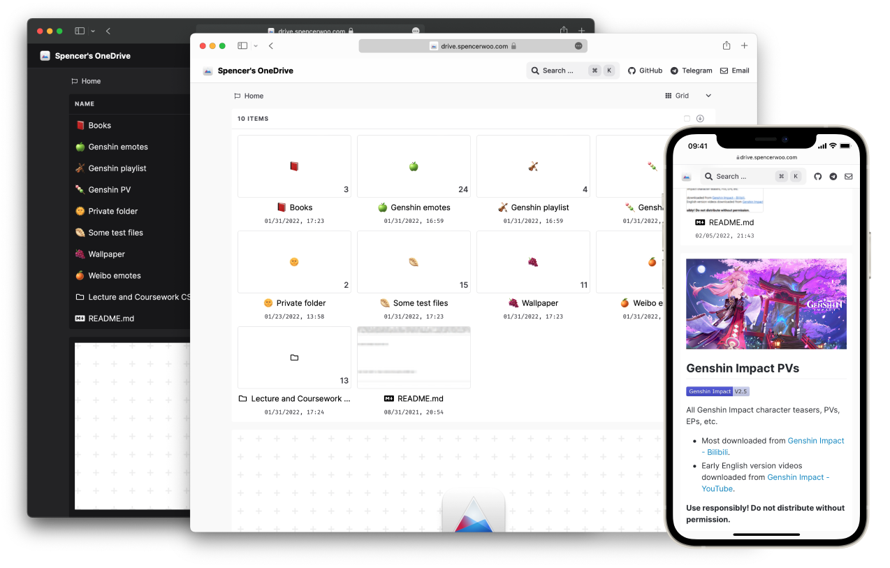

import Bleed from 'nextra-theme-docs/bleed'
import Callout from 'nextra-theme-docs/callout'
import Features from '../components/features'

<h1 className="text-center font-extrabold md:text-5xl mt-8">o米尔嘉的博客</h1>

  总之岁月漫长，然而值得等待。

<Bleed>
  <Features />
</Bleed>

  [Get Started](/docs/getting-started) · [What's new?](/blog/whats-new) · [Sponsoring](/sponsor/ways) · [GitHub
  Repository](https://github.com/spencerwooo/onedrive-vercel-index)

